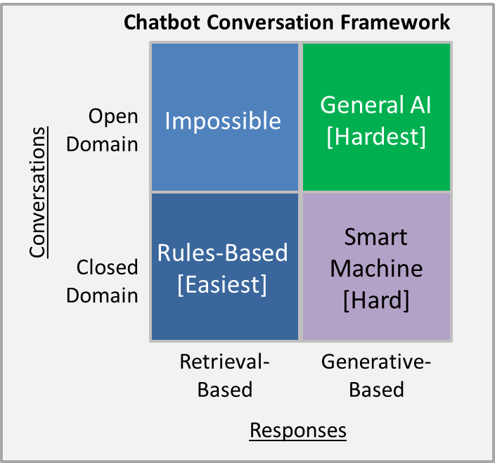

## USPTO ChatBot ##

### General information ###
Chatbots are implemented via Retrieval-based amd Generative models and they exist in either open or closed domain. 

Retrieval-based models are easier and use a repository of predefined responses and some kind of heuristic to pick an appropriate response based on the input. The heuristic approach involves a simple rule-based expression match. These systems don’t generate any new text, they just pick a response from a fixed set. Due to the repository of handcrafted responses, retrieval-based methods don’t make grammatical mistakes. However, they may be unable to handle unseen cases for which no appropriate predefined response exists.

Generative models are harder and don’t rely on pre-defined responses. They generate new responses from scratch. These models are hard to train, are quite likely to make grammatical mistakes, and typically require huge amounts of training data.

Open domain is harder since the user can take the conversation anywhere. Conversations on social media sites (Twitter, Reddit, etc) are typically open domain. The infinite number of topics and the fact that a certain amount of world knowledge is required to create reasonable responses makes this a hard problem.

Closed domain is easier since the space of possible inputs and outputs is somewhat limited because the system is trying to achieve a very specific goal. Technical Customer Support or Shopping Assistants are examples of closed domain problems. These systems don’t need to be able to talk about politics, they just need to fulfill their specific task as efficiently as possible. Users can still take the conversation anywhere they want, but the system isn’t required to handle all these cases and the users don’t expect it to.

Markup : 

### Chosen Implementation ###
Since the goal of this chatbot is to be able to operate in a limited (USPTO) domain, the retrival-based model was chosen and implemented in Python with the AIML package. AIML stands for Artificial Intelligence Markup Language. AIML was developed by Richard Wallace. He made a bot called A.L.I.C.E. (Artificial Linguistics Internet Computer Entity) which won several artificial intelligence awards. AIML is a form of XML that defines rules for matching patterns and determining responses.

### Simple Example ###
'''XML
<aiml version="1.0.1" encoding="UTF-8">
<!-- basic_chat.aiml -->

    <category>
        <pattern>HELLO</pattern>
        <template>
            Hello back!
        </template>
    </category>
    
</aiml>
'''